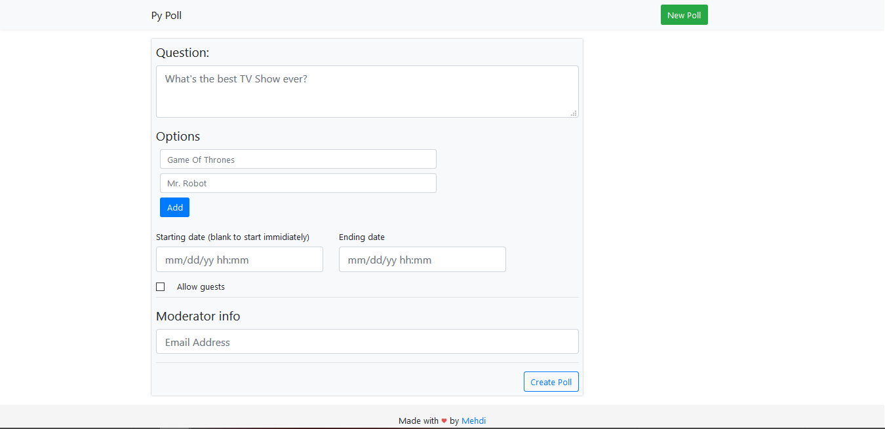
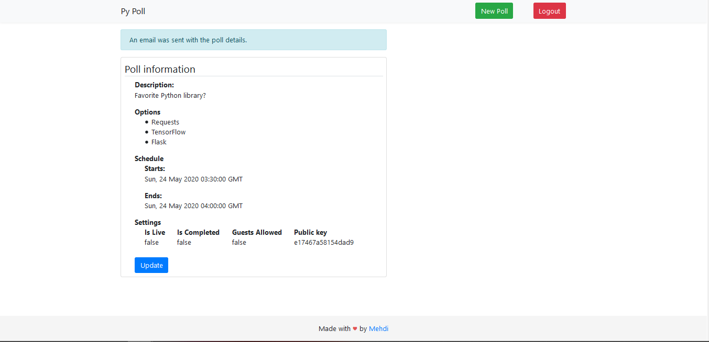
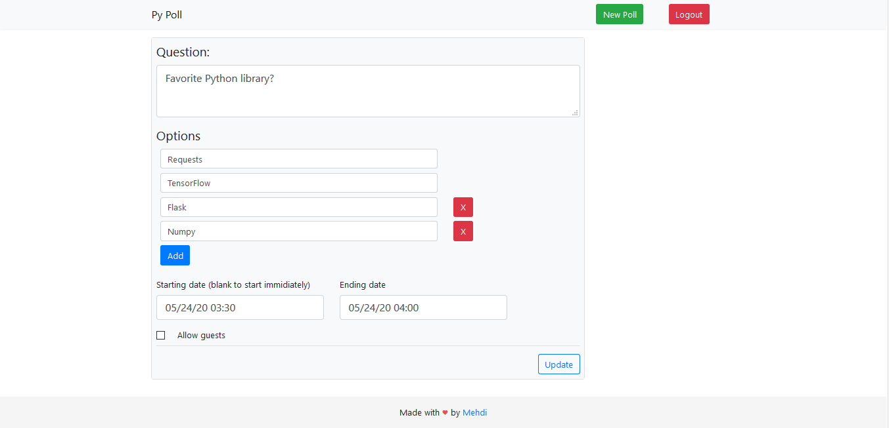
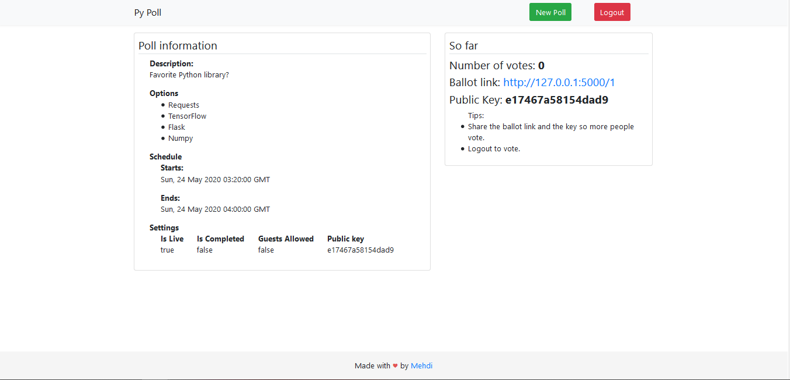
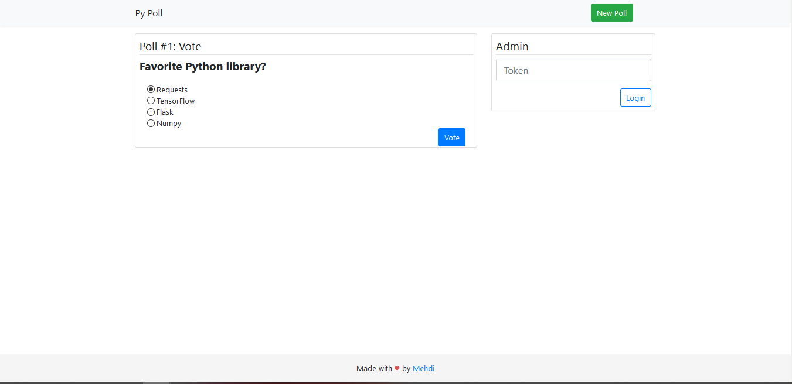
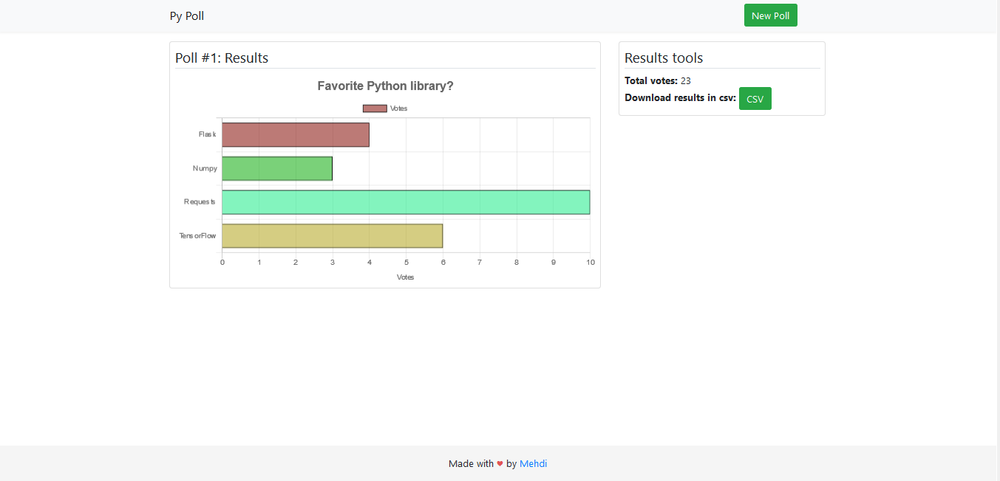

# PyPoll
A simple flask package to create and manage polls.

# Features:

* CSRF Protection.
* Create polls and update them.
* Choose whether to allow guests to vote or not. 
* Send an email full of poll details to the poll creator.
* Support for SQLite, so you can easily interact with the db.
* REST API for sending and retrieving data easily.
* Results visualisation using ChartJS.
* Export the results into a CSV file

# Requirements:

Execute the following command to install the required third party libraries: 

`pip3 install -r requirements.txt`

# Usage:
Clone this repository:

`git clone https://github.com/ElMehdi19/PyPoll.git`

Install the dependencies by simply executing:

`pip3 install -r requirements.txt`

Run this command to start the app:

`cd app`
`python3 run.py`

Visit `127.0.0.1:5000` on your web browser

Happy Voting

# Results

## Creating a new poll
Simple form for creating polls.

## Admin panel
* Ability to edit the poll data if it's not yet live.
* Live voting details once the poll is live.

## Updating the poll

## Live poll data
You can can see how many votes have been submitted once the poll is live.

## Voting
Interface to give allowed users access to vote.

## Poll results
Results barchart visualisation using ChartJS.

